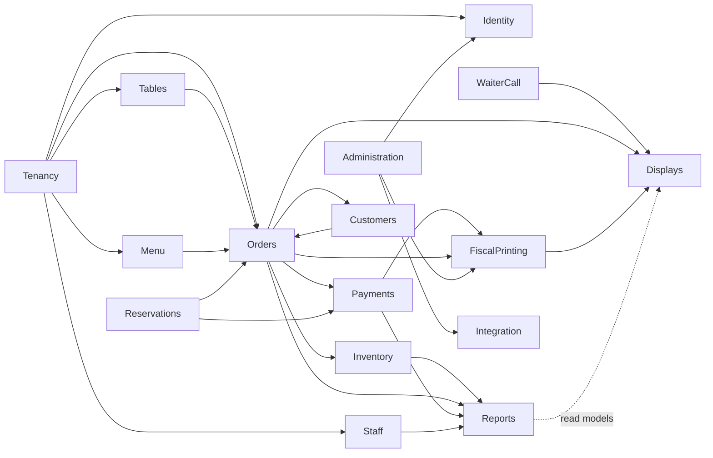
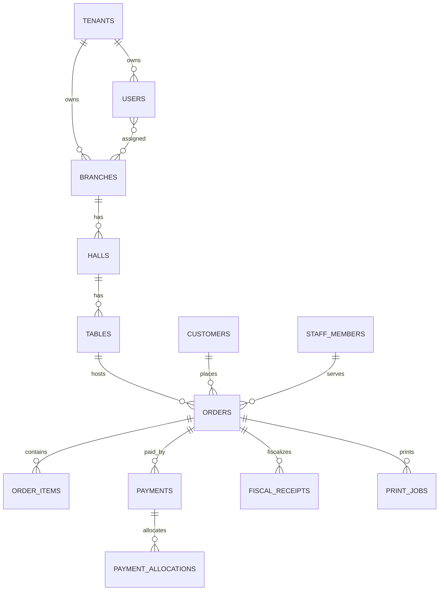
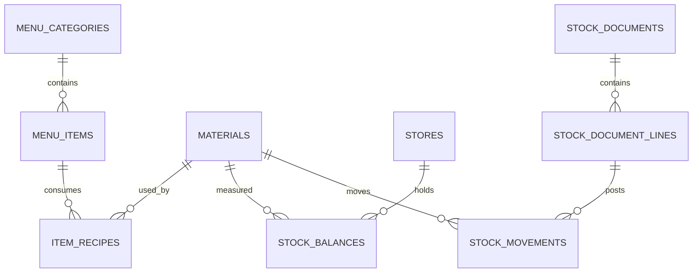

# SmartRest v2 Implementation Blueprint

Version: 1.0

Date: 2026-07-17

How to use this document: this document is the source of truth for SmartRest v2 implementation. Architectural, domain, data model, API, frontend, infrastructure, and roadmap changes must go through pull request review before implementation.

## Table of Contents

- [1. Vision & Domain Overview](#1-vision--domain-overview)
- [2. Architecture Decision Records](#2-architecture-decision-records)
- [3. Module Map](#3-module-map)
- [4. Data Model](#4-data-model)
- [5. Cross-Cutting Concerns](#5-cross-cutting-concerns)
- [6. API Design](#6-api-design)
- [7. Frontend Architecture](#7-frontend-architecture)
- [8. Infrastructure & Delivery](#8-infrastructure--delivery)
- [9. Implementation Roadmap](#9-implementation-roadmap)

## 1. Vision & Domain Overview

SmartRest v2 is a multi-tenant restaurant management SaaS for restaurant companies operating one or more branches. It covers dine-in table service, fast-food/takeaway, delivery/long-distance orders, reservations, kitchen execution, waiter calls, stock, cashbox, fiscal/receipt printing, staff, customers, reporting, and operational administration.

Legacy `template/` screens define product scope and screen semantics. They do not define v2 architecture. `ai-generator.html` is excluded from v2 scope.

Core actors: owner, manager, cashier, waiter, kitchen staff, storekeeper, branch admin, guest, display/TV client, support/super admin.

Glossary:

| English | Armenian | Russian | Meaning |
|---|---|---|---|
| Tenant | Ռեստորանային ընկերություն | Компания ресторана | SaaS customer/company. |
| Branch | Մասնաճյուղ | Филиал | Physical location. |
| Hall | Սրահ | Зал | Dining area/floor section. |
| Table | Սեղան | Стол | Service location for dine-in orders. |
| Order/check | Պատվեր/Հաշիվ | Заказ/счёт | Commercial transaction with items and payments. |
| Preparation place | Պատրաստման վայր | Место приготовления | Kitchen/bar printer routing destination. |
| Fiscal receipt | ՀԴՄ կտրոն | Фискальный чек | Tax/fiscal receipt record and print job. |
| Cashbox | Դրամարկղ | Касса | Money ledger/payment source. |
| Stock document | Պահեստի փաստաթուղթ | Складской документ | Purchase/transfer/write-off/adjustment document. |
| Waiter call | Մատուցողի կանչ | Вызов официанта | Guest-triggered service request lifecycle. |

Key domains from screens: tenants/branches, users/roles, menu, inventory, halls/tables, orders, cashbox/payments, fiscal/printing, reservations, waiter calls, TV/waiting displays, customers/loyalty, staff, reports/analytics, administration.

Differs from legacy screens because v2 separates operational concepts that legacy UI mixes together: payments are not cashbox rows directly, print/fiscal attempts are idempotent jobs, stock movement is event/document driven, and settings/permissions are explicit policies rather than scattered checkboxes.

## 2. Architecture Decision Records

ADR-001 Backend stack. Context: v2 must be maintainable by Laravel/PHP teams and support queues, cache, tests, and relational transactions. Decision: PHP 8.3, Laravel latest supported major compatible with PHP 8.3, PostgreSQL, Redis, Laravel Horizon, Pest. As of July 17, 2026, Laravel 13 requires PHP 8.3 and is active with security fixes until March 17, 2028 per official Laravel release notes. Consequences: use Laravel conventions where helpful, but domain rules remain module-owned, not controller/model-owned. Source: [official Laravel release notes](https://laravel.com/docs/13.x/releases).

ADR-002 Modular monolith. Context: the product has tightly related restaurant workflows but clear bounded contexts. Decision: one Laravel deployable with modules containing `Domain`, `Application`, `Infrastructure`, and `Http`. Modules communicate only through public contracts and domain events. Consequences: simpler deployment than microservices, but strict review rules are needed to prevent cross-module Eloquent/table access.

ADR-003 Shared database tenancy. Context: SaaS must support many restaurant companies and branches from day one. Decision: shared DB, `tenant_id` on every tenant-owned row, branch-owned rows also carry `branch_id`; middleware resolves tenant and branch; Eloquent global scopes enforce tenant isolation. PostgreSQL Row-Level Security will be evaluated in Stage 2 as a second enforcement layer for tenant isolation and implemented if straightforward. Consequences: all queries, indexes, jobs, events, and cache keys include tenant context.

ADR-004 Server-rendered frontend. Context: legacy screens are operational, dense, and server-form oriented. Decision: Blade + Bootstrap 5 + extracted custom CSS tokens via Vite; Alpine for local UI; Livewire for POS, waiter calls, kitchen, displays. No SPA. Consequences: simpler auth/session/i18n, lower frontend complexity, Livewire components must be kept thin and call Application actions.

ADR-005 API-first logic placement. Context: admin Blade, guest QR pages, TV displays, future apps, and future integrations need same business behavior. Decision: all business logic lives in module Application actions/services. Blade and JSON API controllers are adapters. Consequences: every use case gets action tests, controllers mostly validate/authorize/serialize.

ADR-006 i18n from day one. Context: screens are Armenian-heavy and product needs Armenian, Russian, English. Decision: no hardcoded UI strings; translations in `hy`, `ru`, `en`; tenant and user locale settings; locale-aware date, number, currency formatting. Consequences: DB names that users edit are stored as translations or localized value objects.

ADR-007 Money as integer minor units. Context: reports, split payments, debts, fiscal receipts, and cashbox require exact math. Decision: store money as signed integer minor units plus ISO currency. No floats. Consequences: all sums use value objects; fiscal/payment idempotency compares integer amounts.

ADR-008 Domain events and outbox. Context: orders create stock movements, print jobs, fiscal jobs, reports, waiter-call notifications. Decision: synchronous domain events inside transaction for invariants; persisted outbox events for async side effects. Consequences: retryable processing, idempotent handlers, no external effect inside DB transaction.

ADR-009 Audit logging. Context: legacy has operation history and super-admin actions. Decision: auditable commands create structured audit records with actor, tenant, branch, target, before/after, IP/device, correlation id. Consequences: regulatory/debug visibility and safe admin operations.

ADR-010 External integrations boundary only. Context: third-party booking/payment/partner APIs are out of scope. Decision: create an Integration Extension Point module exposing webhook/API contracts and event subscriptions, but no vendor-specific implementation. Consequences: v2 is integration-ready without designing external systems now.

## 3. Module Map

| Module | Responsibility | Public Contracts | Emits | Consumes |
|---|---|---|---|---|
| Tenancy | Tenants, branches, locale/currency defaults, branch context. | `TenantResolver`, `BranchContext`, `TenantSettingsReader` | `TenantCreated`, `BranchCreated` | none |
| Identity & Access | Auth, users, roles, permissions, branch assignment, sessions/devices. | `Authorizer`, `UserDirectory`, `PermissionCatalog` | `UserCreated`, `RoleChanged`, `UserBranchAssigned` | `BranchCreated` |
| Staff | Employees, positions, attendance, salary rules, staff debts. | `StaffDirectory`, `AttendanceRecorder`, `SalaryRuleReader` | `StaffCheckedIn`, `StaffCheckedOut`, `StaffDebtCreated` | `UserCreated` |
| Menu | Menus, categories, items, modifiers, pricing, availability, day schedule, suspend/frozen states. | `MenuCatalog`, `PriceResolver`, `AvailabilityService`, `RecipeReader` | `MenuItemChanged`, `ItemAvailabilityChanged` | `StockLowDetected` |
| Halls & Tables | Halls, floors, table types, table layout, table pricing/commission metadata. | `TableDirectory`, `HallLayoutReader` | `TableCreated`, `TableMoved`, `HallChanged` | none |
| Orders | Dine-in, fast-food, takeaway, delivery/long-distance, subtables, item movement, discounts, comments, customer count. | `OrderCommandService`, `OrderQueryService`, `OrderPricingService` | `OrderOpened`, `OrderItemAdded`, `OrderClosed`, `OrderCancelled`, `OrderMoved` | `MenuItemChanged`, `PaymentCaptured`, `FiscalReceiptIssued` |
| Payments & Cashbox | Payment allocation, partial/split payments, prepayments, debts, cashbox ledger. | `PaymentService`, `CashboxLedger`, `DebtSettlementService` | `PaymentAuthorized`, `PaymentCaptured`, `DebtSettled`, `CashboxEntryPosted` | `OrderClosed`, `ReservationDepositRequested` |
| Fiscal & Printing | Fiscal devices/licenses, fiscal receipts, kitchen/receipt print jobs, printer monitoring. | `ReceiptPrinter`, `FiscalReceiptService`, `PrintQueueReader` | `PrintJobQueued`, `PrintJobFailed`, `FiscalReceiptIssued`, `FiscalReceiptFailed` | `OrderItemAdded`, `OrderClosed`, `PaymentCaptured` |
| Inventory | Stores, materials, categories, units, recipes consumption, stock documents, movements, balances. | `StockService`, `MaterialCatalog`, `StockBalanceReader` | `StockDocumentPosted`, `StockMovementRecorded`, `StockLowDetected` | `OrderClosed`, `MenuItemChanged` |
| Reservations | Table bookings, reminders, deposits, history. | `ReservationService`, `AvailabilityCalendar` | `ReservationCreated`, `ReservationCancelled`, `ReservationDepositRequested` | `PaymentCaptured` |
| Waiter Call | QR guest calls, pending/ack/escalated/expired lifecycle, visual states, timeout re-escalation. | `WaiterCallService`, `WaiterCallFeed` | `WaiterCallCreated`, `WaiterCallAcknowledged`, `WaiterCallEscalated`, `WaiterCallExpired` | `TableMoved`, `OrderClosed` |
| Customers & Loyalty | Customers, cards, bonus/discount balances, feedback, complaints, unserved customers, messaging templates. | `CustomerDirectory`, `LoyaltyService`, `CustomerDebtReader` | `CustomerCreated`, `LoyaltyTransactionPosted`, `ComplaintRaised` | `OrderClosed`, `PaymentCaptured` |
| Reports & Analytics | Read models for reports, dashboards, planning, top/passive sales, audit history. | `ReportQueryService`, `AnalyticsQueryService` | none | all business events |
| Displays | Guest client screen, waiting/ready TV display, kitchen display projections. | `DisplayTokenService`, `DisplayFeed` | `DisplayTokenIssued` | `OrderItemAdded`, `PrintJobQueued`, `WaiterCallCreated` |
| Administration | Super-admin, device config, queue monitor, archive/maintenance, hints. | `AdminMaintenanceService`, `DeviceRegistry`, `HintService` | `MaintenanceJobQueued`, `DeviceRegistered` | queue/printer/audit events |
| Integration Extension Point | Versioned webhooks/API event contracts for future vendors only. | `WebhookSubscriptionRegistry`, `ExternalCommandGateway` | `WebhookDeliveryQueued` | selected public domain events |



Illustrative module layout:

```text
app/Modules/Orders/
  Domain/
  Application/
  Infrastructure/
  Http/
  Contracts/
  Events/
```

## 4. Data Model

Global columns: tenant-owned tables include `id`, `tenant_id`, timestamps, nullable `deleted_at` where restoration is valid, and audit metadata where user actions matter. Branch-owned tables include `branch_id`. Money columns use `*_minor` and `currency`. External effects use `idempotency_key`, `status`, `attempt_count`, `last_error`.

Tenancy/Identity/Staff:

| Entity | Key fields | Relationships/indexes |
|---|---|---|
| `tenants` | name, default_locale, currency, status | unique slug/status index |
| `branches` | tenant_id, name, address, phone, locale, timezone | index tenant/status |
| `users` | tenant_id, name, email/username, default_locale, active | unique tenant+username/email |
| `roles`, `permissions`, `role_permissions` | tenant_id, code/name | unique tenant+code |
| `user_branch_assignments` | tenant_id, user_id, branch_id | unique user+branch |
| `staff_members` | tenant_id, branch_id, first/surname, phones, position_id, card_key_hash | index branch/position |
| `attendance_sessions` | staff_id, started_at, ended_at, source_device_id | index staff/date |
| `salary_types`, `salary_rules` | type flags, staff/menu/item/value | index staff/menu/item |

Menu:

| Entity | Key fields | Relationships/indexes |
|---|---|---|
| `menus` | tenant_id, branch_id nullable, translated_name, color, icon, sort_order, public | tenant+branch+sort |
| `menu_categories` | tenant_id, parent_id nullable, archived_with_category_id nullable, translated_name, sort_order, active, deleted_at | tenant+parent+deleted/active/sort; standalone parent/archive FK indexes |
| `menu_items` | tenant_id, branch_id, category_id, archived_with_category_id nullable, translated_name, price_minor, currency, barcode, hdm_department, preparation_place_id, cook_interval, active, deleted_at | branch/category/active/barcode; standalone branch/category FK indexes |
| `modifiers`, `modifier_options` | translated_name, min/max, price_delta_minor | item/modifier indexes |
| `item_availability_windows` | item_id, day_of_week, starts_at, ends_at | for daily menu scheduling |
| `item_suspensions` | item_id, branch_id, reason, starts_at, expires_at, source | kitchen-level temporary out-of-stock |
| `item_frozen_states` | item_id, reason, frozen_at, thawed_at | archived/frozen item state; retained for history, hidden from sale |
| `item_recipes` | item_id, material_id, quantity, unit_id, waste_percent | item+material unique |

Menu hierarchy is strictly root category -> subcategory -> item. Root
categories have `menu_categories.parent_id = null`; subcategories point to a
root category through `parent_id`. A subcategory cannot contain another
subcategory, and `menu_items.category_id` must reference a subcategory, never a
root category. Application actions enforce the depth rule and item placement;
the database enforces self-FK integrity and `parent_id <> id`.

Menu archive is soft delete. Archiving a root category cascades archive to its
currently active subcategories and their currently active items, marking
descendants with `archived_with_category_id` so restore only reopens records
archived by that cascade. Archiving a subcategory cascades only to its own
currently active items. Independently archived descendants remain archived
during parent restore. Permanent force-delete is superadmin-only maintenance.

Menu scaffold context: `menu-day` becomes daily availability scheduling; `menu-suspend` becomes temporary kitchen/branch out-of-stock; `menu-frozen` becomes frozen/archived sale state for items retained for historical receipts and possible reactivation. This differs from legacy scaffold tables because v2 models three separate availability concepts instead of one generic status list.

Orders/Payments/Fiscal:

| Entity | Key fields | Relationships/indexes |
|---|---|---|
| `orders` | branch_id, type, status, table_id, customer_id, waiter_id, cashier_id, opened_at, closed_at, client_count, comment, subtotal_minor, discount_minor, total_minor | tenant+branch+status/opened |
| `order_subtables` | order_id, name, status | order+status |
| `order_items` | order_id, subtable_id, menu_item_id, qty, unit_price_minor, discount_minor, total_minor, seller_id, preparation_status | order/status/item |
| `order_item_moves`, `order_moves` | source/target order/table, actor, reason | audit indexes |
| `payments` | order_id nullable, reservation_id nullable, cashbox_id, method, status, amount_minor, idempotency_key | unique idempotency, order/status |
| `payment_allocations` | payment_id, payable_type/id, amount_minor | split/partial payments |
| `cashboxes` | branch_id, translated_name, default, non_cash, card, fiscal_enabled | branch/default |
| `cashbox_entries` | cashbox_id, direction, amount_minor, reason, source_type/id, posted_by | cashbox/date |
| `debts` | debtor_type/id, source_type/id, total/paid/balance_minor, status | debtor/status |
| `fiscal_receipts` | order_id/payment_id, device_id, fiscal_number, amount_minor, status, idempotency_key | unique idempotency/fiscal no |
| `print_jobs` | printer_id, type, payload_ref, status, attempts, idempotency_key | status/next_attempt |

Inventory:

| Entity | Key fields | Relationships/indexes |
|---|---|---|
| `stores` | branch_id, translated_name, active | branch/name |
| `material_categories` | tenant_id, translated_name | tenant/name |
| `materials` | category_id, translated_name, unit_id, code, purchase_price_minor, min/max_qty | tenant+code/category |
| `stock_documents` | branch_id, type, supplier_id, status, date, amount_minor, identification_no | branch/type/status/date |
| `stock_document_lines` | document_id, material_id, store_id, qty, unit_cost_minor | document/material |
| `stock_movements` | material_id, store_id, type, qty_delta, cost_delta_minor, source_type/id | material/store/date |
| `stock_balances` | material_id, store_id, qty, avg_cost_minor, actual_qty | unique material+store |

Store scaffold context: `store-history` and `store-sum` are treated as stock reporting/read models: historical document/movement summaries and balance recalculation/summary views, not separate write modules.

Reservations/Waiter Calls/Customers:

| Entity | Key fields | Relationships/indexes |
|---|---|---|
| `reservations` | branch_id, table_id, customer_name, phone, starts_at, deposit_due_minor, deposit_paid_minor, status, reminder_at | branch/date/status |
| `waiter_calls` | branch_id, table_id, guest_token_id, status, created_at, acknowledged_at, escalated_at, expires_at, assigned_staff_id | branch/status/date |
| `waiter_call_events` | waiter_call_id, event_type, actor_id nullable, occurred_at, metadata | call/date |
| `guest_tokens`, `display_tokens` | branch/table/display scope, token_hash, expires_at, revoked_at | token hash unique |
| `customers` | tenant_id, name, phone, email, address, birthday, gender, company_id | tenant+phone/email |
| `loyalty_cards` | customer_id, card_number, percent, balance_minor, type | unique tenant+card |
| `customer_feedback`, `complaints`, `unserved_records` | customer/phone/type/message/status | status/date |

Reporting/Admin:

| Entity | Key fields | Relationships/indexes |
|---|---|---|
| `audit_logs` | tenant_id, branch_id, actor_id, action, target_type/id, before_json, after_json, correlation_id | tenant/date/action |
| `report_snapshots` | branch_id, kind, period_start/end, payload_json | kind/period |
| `admin_devices` | branch_id, device_key, name, cashbox_id, last_seen_at, status | branch/device |
| `queue_job_logs` | job_uuid, type, status, attempts, payload_hash | status/type/date |
| `hints` | key, page, translations, sort_order, active | key unique |





Soft deletes: allowed for catalog/configuration entities where history must remain; not allowed for financial ledgers, payments, fiscal receipts, stock movements, audit logs. Those use reversal/void records.

## 5. Cross-Cutting Concerns

Authn/Authz: Laravel session auth for admin/employee UI; token auth for guest QR and displays. Permissions are action-based, e.g. `orders.close`, `payments.refund`, `stock.documents.post`, `admin.maintenance.run`. Roles are tenant-defined, branch assignment restricts data visibility. Policies call Identity contracts, not raw tables.

Multi-tenancy: `ResolveTenant` middleware derives tenant from domain/header/session/token; `ResolveBranch` sets branch context. All tenant models use `TenantScoped` global scope and `BelongsToTenant` trait. Jobs serialize tenant/branch ids and restore context before execution. Cache keys use `tenant:{id}:branch:{id}:...`.

i18n: UI strings use translation keys. DB localized names use JSON translation value object with fallback order user locale -> tenant locale -> `en`. Currency/date/number formatting happens in presenters/resources, not domain services.

Audit logging: Application actions emit audit records for mutable operations. Logs include actor, tenant, branch, device, IP, target, before/after, command payload hash, correlation id.

Queues/jobs: Redis queues split by domain: `printing`, `fiscal`, `inventory`, `reports`, `notifications`, `integrations`. Horizon monitors workers. Jobs are idempotent and retry-safe. Fiscal/printing retries use exponential backoff and manual retry/cancel states.

File storage: tenant-scoped disks/paths for product images, staff photos, hall plans, exports. Stored files carry owner type/id and visibility. No direct public paths; signed URLs for private exports.

Error handling: Application actions throw domain exceptions with stable error codes. Controllers map to JSON/API or Blade flash messages. Validation errors are field-based. External effects never hide failed DB state.

Money/currency: all money is integer minor units. A tenant has default currency; mixed-currency operations are rejected unless explicitly supported later. Reports compute from ledgers, not recalculating from mutable item prices.

Idempotency: required for payments, fiscal receipts, print jobs, stock posting, webhook delivery, and public guest actions. Duplicate keys return original outcome.

Waiter Call lifecycle: `pending -> acknowledged -> resolved`, with alternate terminal `expired`. If pending exceeds tenant-configured threshold, event `WaiterCallEscalated` changes visual state and can notify manager/display. Calls expire after stale timeout or order/table closure. Acknowledge records actor/device/time. Guest QR can only create/see calls for its scoped table token.

## 6. API Design

URL conventions:

- Admin Blade routes: `/admin/...`, session authenticated.
- Public JSON API: `/api/v1/...`, versioned, stable resources.
- Guest QR API: `/api/v1/guest/{token}/...`, scoped token.
- Display API: `/api/v1/displays/{token}/...`, display token.
- Internal webhook extension point: `/api/v1/integrations/webhooks/...`, contract only.

Response envelope:

```json
{
  "data": {},
  "meta": { "request_id": "...", "locale": "hy" },
  "errors": []
}
```

Pagination: cursor pagination for live feeds and large logs, page pagination for admin tables. Use `meta.pagination` with `next_cursor`, `prev_cursor`, `per_page`.

Error format:

```json
{
  "errors": [
    { "code": "orders.table_already_open", "message": "...", "field": null }
  ],
  "meta": { "request_id": "..." }
}
```

Auth by client:

| Client | Auth | Scope |
|---|---|---|
| Admin Blade | Session + CSRF | tenant/user/branch permissions |
| Admin API | Sanctum/session token | same as user permissions |
| Guest QR | signed token hash | one branch/table/order session |
| TV/display | display token | read-only branch/display feed |
| Integration extension | HMAC/webhook token | subscribed events only |

Endpoint groups:

| Module | Main groups |
|---|---|
| Tenancy | tenants, branches, branch context |
| Identity | users, roles, permissions, sessions, user-branches |
| Staff | staff, attendance, salary-types, salary-rules, debts |
| Menu | menus, categories, items, modifiers, availability, daily schedule, suspensions, frozen states |
| Tables | halls, floor plans, table types, tables |
| Orders | orders, order-items, subtables, moves, kitchen status, fast-food queues |
| Payments | payments, allocations, cashboxes, ledger, debts, prepayments |
| Fiscal/Printing | fiscal-devices, fiscal-receipts, printers, print-jobs, preparation-places |
| Inventory | stores, materials, categories, stock-documents, balances, movements |
| Reservations | reservations, calendar, deposits, reminders |
| Waiter Calls | guest calls, staff feed, acknowledge, resolve, escalate/expire jobs |
| Customers | customers, loyalty-cards, feedback, complaints, unserved |
| Reports | dashboard, sales, checks, table history, delivery, stock, audit logs |
| Displays | client-screen feed, waiting-display feed, kitchen-display feed |
| Integrations | webhook subscriptions, event catalog, delivery logs only |

## 7. Frontend Architecture

Blade structure:

```text
resources/views/layouts/admin.blade.php
resources/views/components/
  shell/header.blade.php
  shell/sidebar.blade.php
  tables/data-table.blade.php
  forms/field.blade.php
  modals/confirm.blade.php
  money.blade.php
resources/views/modules/{module}/{screen}.blade.php
```

Template-derived visual system: extract colors, spacing, cards, dense tables, badges, sidebar/header, modals, and status states from `template/assets/template.css` and legacy CSS into Bootstrap-compatible CSS variables. Keep operational density where useful, but replace inline styles and duplicated modal markup with components.

Design tokens:

```css
:root {
  --sr-color-success: ...;
  --sr-color-danger: ...;
  --sr-sidebar-width: ...;
  --sr-table-status-open: ...;
}
```

Alpine usage: dropdowns, local filters, modal toggles, small calculators, keyboard shortcuts, non-persistent state.

Livewire usage: POS, table board, table order page, add order item, kitchen screen, waiter call board, print/fiscal monitoring, waiting/TV displays. Livewire components call Application actions and subscribe to events/read models; they do not contain pricing/payment/stock rules.

Vite setup: compile Bootstrap 5, extracted SmartRest CSS tokens, module-specific JS/CSS entrypoints, and static assets. Legacy custom CSS is migrated incrementally into `resources/css/smartrest/*.css`.

i18n in views: all labels use `__('orders.close')`; validation messages localized; enum labels exposed by modules as translation keys. User locale selected in header; tenant fallback applied automatically.

Differs from legacy screens because v2 removes hardcoded Armenian labels, inline credentials, repeated shared modals, and jQuery-driven business behavior. UI behavior remains familiar, but state changes go through typed Application actions.

## 8. Infrastructure & Delivery

Local dev: Docker Compose with app PHP-FPM/CLI, Nginx, PostgreSQL, Redis, Horizon worker, mailhog-compatible mail catcher, optional local object storage. Seed demo tenant/branch/users/menu for walking skeleton.

CI:

- Composer validate/install.
- Pint formatting.
- PHPStan/Larastan strict baseline.
- Pest unit/application/feature tests.
- Frontend build via Vite.
- Migration check and tenant-scope static checks.
- No direct cross-module model/table access checks via architecture tests.

Deployment: containerized app, Kubernetes-ready. Separate containers/processes for web, queue workers, scheduler, Horizon dashboard. Readiness checks cover DB, Redis, storage. Liveness checks stay shallow.

Config/secrets: `.env` only for local; production uses secret manager/Kubernetes secrets. No fiscal/payment/printer secrets in DB plaintext; encrypt sensitive config values.

Migrations: module-owned migrations in release order. Use additive migrations first, backfill jobs where needed, then constraints. Every tenant-owned table requires `tenant_id` index and architecture test. Financial/stock tables require non-null currency/idempotency where relevant.

Backups: automated DB backups with point-in-time recovery target, encrypted object storage backups, restore drill expectation. Export/download DB is super-admin only and audited.

Logging/monitoring: structured JSON logs with request/correlation/tenant/branch ids. Metrics for queue latency, print/fiscal failures, payment failures, waiter-call escalation count, order-close latency, DB slow queries. Alerts on failed fiscal/print job spikes and Horizon worker failures.

## 9. Implementation Roadmap

Phase 1: Walking skeleton. Goal: prove tenancy, auth, module structure, Blade/API adapters, i18n, tests, CI. Deliver Tenancy, Identity, Menu vertical slice with menu/category/item CRUD. Definition of done: tenant/branch middleware, role permission check, Blade CRUD, `/api/v1/menu-items`, translations `hy/ru/en`, Pest action/controller tests, PHPStan/Pint/CI green. Demo: login as branch manager, create menu item, see it through API.

Phase 2: Halls/Tables + basic orders. Goal: dine-in operational core. Deliver halls, tables, table board, open order, add/remove item, subtables, waiter assignment. Definition of done: Livewire table board and order page call Application actions; order totals use money value objects; audit logs written. Demo: open table, add items, move item to subtable.

Phase 3: Payments/Cashbox/Fiscal/Printing. Goal: close orders correctly. Deliver cashboxes, split/partial payments, prepayments, debts, print jobs, fiscal receipt queue, printer monitoring basics. Definition of done: idempotent payments/receipts/print jobs, retry/cancel flows, cashbox ledger immutable. Demo: split pay one order, print kitchen/check, fiscal retry.

Phase 4: Inventory/Menu recipes. Goal: connect sales to stock. Deliver stores, materials, categories, stock documents, posting, balances, recipes, stock consumption from closed orders. Definition of done: stock movements are document/event driven, no negative stock unless setting permits, low-stock events. Demo: post purchase document, sell recipe item, see balance decrease.

Phase 5: Reservations, Waiter Call, Displays. Goal: guest-facing workflows. Deliver reservations/deposits/history, guest QR waiter call lifecycle with escalation/expiry, client screen, waiting/ready display, kitchen display. Definition of done: token-scoped guest/display APIs, Livewire feeds, timeout jobs, visual states. Demo: guest QR calls waiter, staff acknowledges, stale call escalates if ignored.

Phase 6: Customers/Loyalty/Staff. Goal: CRM and HR operations. Deliver customers, cards/history, customer debts, complaints/feedback/unserved, staff records, attendance, staff debts, salary rules. Definition of done: branch-safe access, messaging templates without external SMS implementation, loyalty ledger immutable. Demo: attach customer/card to order, settle debt, view attendance.

Phase 7: Reports/Analytics/Admin. Goal: operational visibility and admin controls. Deliver dashboard, sales/check/table/delivery/movement/stock/audit reports, planning/top-passive/order/sales analytics, queue/admin/device/hints/maintenance screens. Definition of done: read models or optimized queries, export jobs, permissions/audit on admin actions. Demo: close several orders and show reports, queue monitor, audit trail.

Phase 8: Integration extension point. Goal: future-proof without building third-party integrations. Deliver event catalog, webhook subscription registry, HMAC signing, delivery logs, retry policy, public command gateway interfaces. Definition of done: internal demo subscriber receives `OrderClosed` and `ReservationCreated`; no vendor-specific code. Demo: register webhook endpoint in dev and inspect delivery log.
